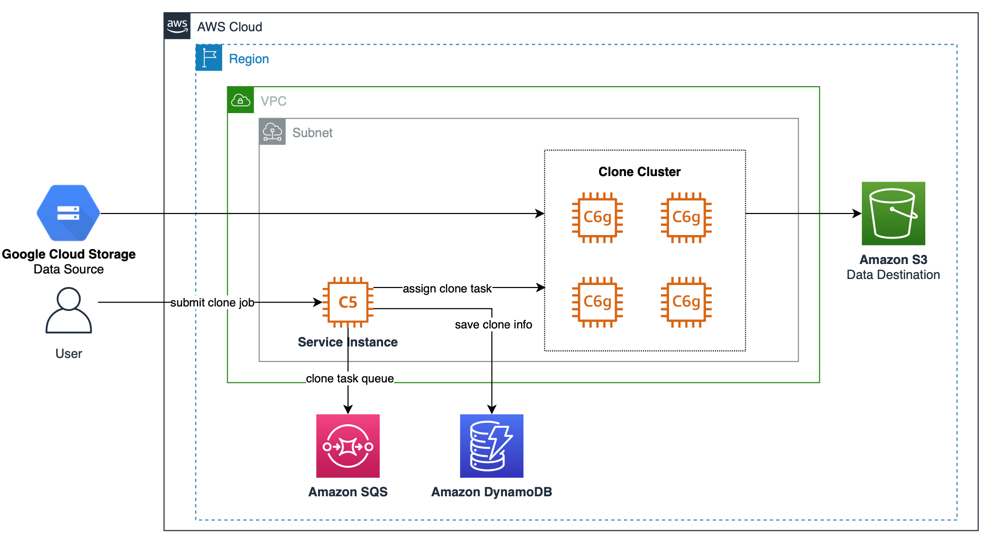

Cloud Storage To AWS S3 Tool
======================================

This tool is used to transfer data from Google GCS and other cloud providers (supported by Rclone) to AWS S3. It allows you to batch start and manage EC2 instances to transfer a large amount of data in parallel.
The architecture diagram based on Google GCS as the data source is as follows:

Component functions:

- Amazon SQS: Stores and sorts transfer tasks after they are issued.

- Amazon DynamoDB: Automatically creates three tables for storing transfer devices, task status, and configurations during system initialization.

Prerequisites
-------------
Building the project
--------------------

Navigate to the newly created folder:

Run the project with:

    mvn clean spring-boot:run

Navigate to:

    http://localhost:8080

Login with: `user` and `demo`

Package the application
-----------------------

To package the project run:

    mvn clean package
We need to use the packaged jar file as the executable program.

The deployment document can be found in the deployment-guidance.pdf file in the repository. The document is in Chinese. If you need an English version, please feel free to contact us.

## Security

See [CONTRIBUTING](CONTRIBUTING.md#security-issue-notifications) for more information.

## License

This library is licensed under the MIT-0 License. See the LICENSE file.
